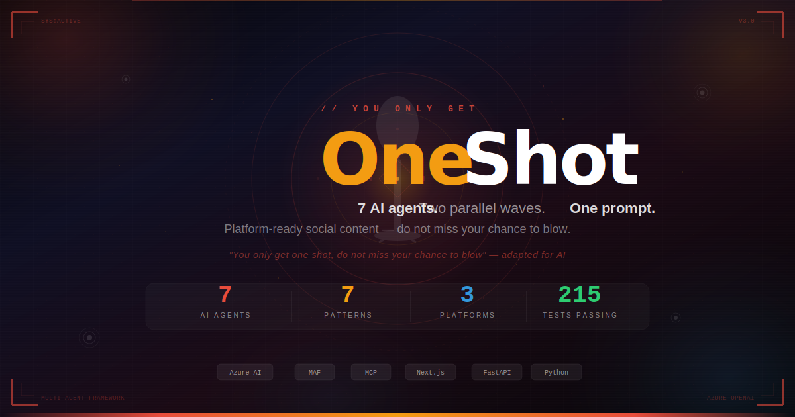
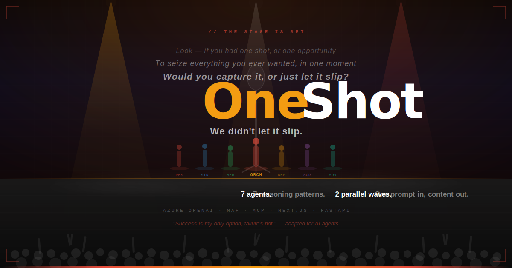
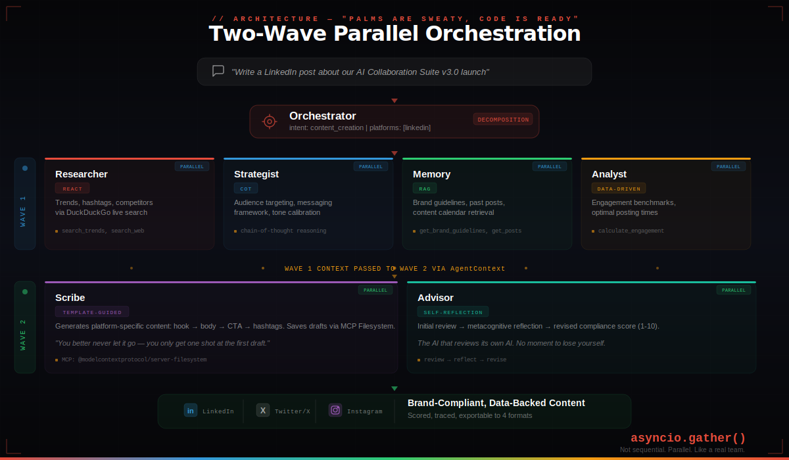
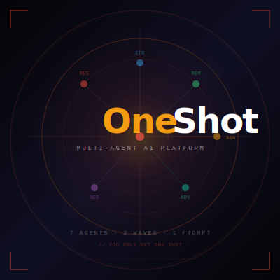

<p align="center">
  
</p>

<h1 align="center">OneShot</h1>

<p align="center">
  <strong>You only get one shot. Do not miss your chance to blow.</strong><br/>
  <em>7 AI agents. Two parallel waves. One prompt. Platform-ready social content.</em>
</p>

<p align="center">
  
</p>

<p align="center">
  
  
  
  
  
  
  
  
  
  
  
</p>

<p align="center">
  <a href="https://oneshot-ctr-frontend.ambitiouscoast-16cae529.eastus2.azurecontainerapps.io/">
    
  </a>
</p>

<p align="center">
  <strong>🌐 <a href="https://oneshot-ctr-frontend.ambitiouscoast-16cae529.eastus2.azurecontainerapps.io/">Try OneShot Live →</a></strong><br/>
  Deployed on <strong>Azure Container Apps</strong> (East US 2) — containerized frontend and backend running in a fully managed serverless environment with automatic scaling, built-in HTTPS, and zero-downtime deployments.
</p>

---

## The Problem

Enterprise social media teams hit the same bottleneck every day:

> Research → Strategy → Writing → Compliance → Analytics — **all sequential, all manual, all slow.**

Different people. Different tools. Handoff friction at every stage. By the time content ships, the trend is over.

## The Solution: OneShot

**OneShot** takes a single prompt — *"Write a LinkedIn post about our AI launch"* — and fires 7 specialized AI agents in two parallel waves. Research, strategy, brand context, analytics, writing, and compliance review happen **simultaneously**, not sequentially. Content comes out platform-specific, brand-compliant, data-backed, and scored.

Like a real content team — but in seconds. *You only get one shot at the first draft. Make it count.*

> **Agents League @ TechConnect — Track 2: Reasoning Agents.** The challenge asks participants to build an intelligent agent that helps a company's communication team create social media content across platforms using multi-step reasoning. OneShot answers that challenge with 7 coordinated MAF agents, 5 distinct reasoning patterns, grounded brand data, MCP tool integration, and a full production UI — everything the starter kit describes as aspirational "Going Further" bonuses, we ship as core features.

---

<p align="center">
  
</p>

---

## Two-Wave Parallel Architecture

<p align="center">
  
</p>

```
User Prompt
     │
     ▼
 ORCHESTRATOR ──── intent classification, platform detection
     │
     ├── Wave 1: Context Gathering (parallel via asyncio.gather)
     │   ├── Researcher  [ReAct]            → trends, hashtags, competitors
     │   ├── Strategist  [Chain-of-Thought] → audience, messaging, tone
     │   ├── Memory      [RAG]             → brand guidelines, past posts
     │   └── Analyst     [Data-Driven]     → engagement benchmarks, timing
     │
     ├── Wave 1 context passed to Wave 2 via AgentContext
     │
     ├── Wave 2: Create + Review (parallel)
     │   ├── Scribe      [Template-Guided]  → platform-specific content
     │   └── Advisor     [Self-Reflection]  → compliance score (1-10)
     │
     ▼
 Brand-Compliant, Data-Backed Content
 (scored, traced, cited, exportable to 4 formats)
```

**Key insight**: Wave 2 agents don't create blind — they receive all Wave 1 context. The Scribe writes *informed by* live trends, strategy, brand voice, and engagement data. The Advisor reviews against *actual* brand guidelines and past post patterns.

### Containerized Deployment with azd

Both services are now containerized and wired into `azd`.

1. Provision infrastructure:
    - `azd provision`
2. Deploy both application containers:
    - `azd deploy`
    - or run `azd up` for provision + deploy in one command.

The deployment flow currently excludes brand-data seeding. Continue using your team setup/bootstrap scripts for data initialization.

Deployment behavior in Azure:

- Frontend resolves backend endpoints from runtime-injected config (server render path), not build-time-only `NEXT_PUBLIC_*`.
- Runtime endpoint vars are populated by infra as `RUNTIME_API_URL` and `RUNTIME_WS_URL` from the backend Container App **actual FQDN output**.
- Backend CORS is strict for deployed Container Apps (`ALLOWED_ORIGINS=[]` with `ALLOWED_ORIGIN_REGEX` scoped to the frontend app hostname pattern).
- `azure.yaml` sets Docker `registry` explicitly from `AZURE_CONTAINER_REGISTRY_ENDPOINT`.
- Container Apps are tagged in IaC with `azd-service-name` so `azd deploy --service backend|frontend` resolves targets consistently.

Common `azd` deployment recovery:

- Registry endpoint error (`could not determine container registry endpoint`)
  - Ensure azd env has `AZURE_CONTAINER_REGISTRY_ENDPOINT` and `AZURE_CONTAINER_REGISTRY_NAME`.
- Service tag lookup error (`resource tagged with 'azd-service-name' not found`)
  - Run `azd provision` to refresh tags/resources from IaC.
- Frontend points to stale/non-resolving backend host
  - Run `azd provision`, then `azd deploy --service frontend` to refresh runtime endpoint vars.

---

## Reasoning Patterns — The Core of Track 2

> *"This is not 7 copies of GPT with different system prompts."* — Each agent has a **named reasoning identity** drawn from established AI research patterns.

The Track 2 rubric weights **Reasoning & Multi-step Thinking at 25%** — the joint-highest criterion. OneShot implements every reasoning pattern the starter kit calls for, and then some:

<p align="center">
  
</p>

| # | Agent | Reasoning Pattern | How It Reasons |
|:-:|-------|-------------------|----------------|
| 🎯 | **Orchestrator** | **Step-by-Step Decomposition** | Classifies intent via structured output → detects platforms → dispatches two-wave parallel execution |
| 🔍 | **Researcher** | **ReAct (Reasoning + Acting)** | Thought → Action → Observation → Thought loops. Calls `search_web`, `search_news`, `analyze_hashtags` tools between reasoning steps |
| ♛ | **Strategist** | **Chain-of-Thought (CoT)** | "Step 1: IDENTIFY audience → Step 2: ANALYZE message → Step 3: DETERMINE tone → Step 4: PLAN calendar → Step 5: RECOMMEND CTAs" — deliberate, numbered, explainable |
| 🧠 | **Memory** | **Retrieval-Augmented Grounding (RAG)** | Retrieves brand guidelines, past post performance, content calendars. Grounds generation in real data — zero hallucination on brand voice |
| 📊 | **Analyst** | **Data-Driven Benchmarking** | Calculates engagement predictions, optimal posting times, performance comparisons against historical baselines. Numbers, not guesses |
| ✍ | **Scribe** | **Template-Guided Generation** | Platform-specific structural rules: LinkedIn (1300 chars, hook-first), Twitter/X (280 chars, punchy), Instagram (visual-first). Saves drafts via MCP |
| 🛡 | **Advisor** | **Self-Reflection** | Initial review → "Wait, did I check brand voice consistency?" → metacognitive reflection → revised compliance score (1-10). The AI that critiques the AI |

### Reasoning in Action

```python
# ReAct pattern in Researcher — interleaved reasoning and tool use
Thought: "I need to find current AI industry trends for the LinkedIn post."
Action:  search_web("AI industry trends February 2026")
Observe: [5 results with URLs and snippets]
Thought: "These trends are relevant. Now I need competitor positioning."
Action:  search_news("enterprise AI product launches this week")
Observe: [3 news articles]
Thought: "I have enough context. Let me synthesize findings."
→ Returns: trend summary + source citations + hashtag recommendations

# Self-Reflection pattern in Advisor
Initial Review: "Content is on-brand. Score: 8/10."
Reflection:     "Wait — did I verify hashtag compliance? Let me re-check against guidelines."
Revised:        "Hashtag #BuildInPublic is approved. Tone matches LinkedIn persona. Score: 9/10."
```

---

## Grounding & Data Sources

Agents are grounded on real brand data — not just system prompt instructions. The Memory agent uses **Retrieval-Augmented Generation (RAG)** to pull from three synthetic data sources seeded into the knowledge base:

| Data Source | File | What It Provides |
|-------------|------|-----------------|
| **Brand Guidelines** | `data/brand_guidelines.md` | Voice, tone per platform, hashtag strategy, DOs/DON'Ts, audience personas |
| **Past Post Performance** | `data/past_posts.json` | 5+ high-performing posts with engagement metrics (likes, shares, impressions) |
| **Content Calendar** | `data/content_calendar.json` | Weekly content plan, theme scheduling, platform cadence |

The Analyst benchmarks new content against past post engagement data. The Scribe follows brand voice guidelines. The Advisor reviews compliance against documented DOs and DON'Ts.

---

## MCP & Tool Integration

Agents extend beyond pure language generation via [Model Context Protocol (MCP)](https://modelcontextprotocol.io/) servers and direct tool integrations — spawned as subprocesses and auto-registered on MAF agents at runtime.

| Integration | Type | Agent | Purpose |
|-------------|------|-------|---------|
| **Filesystem MCP** (`@modelcontextprotocol/server-filesystem`) | MCP Server | Scribe | Saves generated content drafts to `./data/drafts/` |
| **DuckDuckGo Search** (`ddgs`) | Python Tool | Researcher | Live web search and news search for trend grounding |

```python
from agent_framework import MCPStdioTool

fs_mcp = MCPStdioTool(
    name="filesystem",
    command="npx",
    args=["-y", "@modelcontextprotocol/server-filesystem", "./data/drafts"],
)
agent = client.create_agent(name="scribe", instructions=SCRIBE_PROMPT, tools=[fs_mcp])
```

14 tool functions across 7 agents — `search_web`, `search_news`, `search_trends`, `analyze_hashtags`, `search_competitor_content`, `get_brand_guidelines`, `get_past_posts`, `get_content_calendar`, `search_knowledge_base`, `calculate_engagement_metrics`, `recommend_posting_schedule`, `generate_content_draft`, `save_draft`, and `review_content`. Each tool is an MAF `@ai_function`-decorated Python function that the agent invokes during reasoning.

MCP is optional — agents gracefully fall back to direct LLM calls when servers are unavailable.

---

## Observability: Citation Tracing & Agent Analytics

Every agent execution is fully traced with citations, tool calls, and performance metrics — giving complete visibility into *how* and *why* content was generated.

### Citation Pipeline

```
Agent executes tool (e.g., search_web)
  → middleware extracts URLs + source labels from output
  → knowledge tools (brand guidelines, past posts) generate knowledge citations
  → citations deduplicated and attached to agent trace
  → WebSocket pushes agent.citations + response.citations events
  → Frontend renders CitationPanel with source attribution
```

**Citation types:**
- **URL citations** — extracted from web search results (DuckDuckGo)
- **Knowledge citations** — generated when agents reference brand guidelines, past posts, or content calendar
- **Text citations** — captured from "Source: ..." patterns in agent output

### Trace Waterfall

The Analytics page (`/analytics`) visualizes the full execution trace:

- Per-agent execution time (ms), token usage, and success/failure status
- Tool call history — which tools each agent invoked and what they returned
- Citation provenance — trace every claim back to its source
- Parallel execution visualization — see both waves firing simultaneously

### REST API

```
GET  /api/analytics/traces              → All agent execution traces
GET  /api/analytics/traces/:id          → Single trace with full citation + tool detail
GET  /api/analytics/metrics             → Aggregate metrics (avg response time, token usage)
POST /api/conversations/:id/messages    → Trigger multi-agent execution
WS   /ws/agents/:conversation_id        → Real-time agent status + citation streaming
```

---

## Track 2 Alignment

How OneShot maps to every Track 2 milestone and bonus item:

### Milestones

| Milestone | Requirement | Our Implementation |
|-----------|------------|-------------------|
| **M1: Environment** | Deploy a reasoning model in Foundry | Azure OpenAI GPT-5.x deployed. MAF `AzureOpenAIResponsesClient` connected via `factory.py`. `DefaultAzureCredential` — zero secrets. |
| **M2: Create Agent** | Define instructions, brand context, reasoning patterns | 7 MAF agents created via `factory.py` with CoT, ReAct, Self-Reflection, RAG, and Template-Guided reasoning in structured prompts |
| **M3: Grounding** | Integrate relevant data sources | Brand guidelines + past post performance + content calendar seeded into knowledge base. Memory agent retrieves via RAG. |
| **M4: External Tools** | Integrate MCP servers or APIs | Filesystem MCP for draft persistence + DuckDuckGo for live web search. 14 `@ai_function` tool functions. |

### Bonus Features (all implemented)

The Track 2 starter kit describes these as aspirational "Going Further" items. We ship them as core features:

| Bonus Item | Starter Kit Description | OneShot Implementation |
|------------|------------------------|----------------------|
| **Multi-Agent Architecture** | "Decompose tasks across specialized agents" | 7 agents orchestrated in two parallel waves via `asyncio.gather` |
| **Reviewer Agent** | "Create a reviewer agent that checks content for quality and compliance" | Advisor agent with Self-Reflection: review → reflect → revise → score (1-10) |
| **Evaluation** | "Set up performance metrics using Foundry's built-in evaluation tools" | Citation tracing pipeline + per-agent execution metrics + Analytics dashboard |
| **Monitoring** | "Track agent usage and performance over time" | Real-time WebSocket status panel (6 event types) + SQLite trace persistence + Recharts visualizations |
| **Safety** | "Add safety mitigation layers for policy compliance" | Advisor agent enforces brand DOs/DON'Ts + content quality scoring + hashtag compliance checking |

---

## Tech Stack

| Layer | Technology |
|-------|------------|
| **AI Framework** | Microsoft Agent Framework (MAF) — `agent-framework` with `AzureOpenAIResponsesClient`, `@ai_function` tools, MCP support |
| **Models** | Azure OpenAI GPT-5.x via Foundry endpoints |
| **Frontend** | Next.js 16, React 19, Shadcn/ui, Tailwind CSS 4, Zustand 5, Recharts |
| **Backend** | Python 3.11+, FastAPI 0.115, SQLAlchemy 2.x, aiosqlite |
| **Auth** | Azure Identity (`DefaultAzureCredential`) — zero secrets in config |
| **MCP** | Filesystem MCP (`@modelcontextprotocol/server-filesystem`) for draft persistence |
| **Search** | DuckDuckGo Search (`ddgs`) — live web and news search, no API key required |
| **Database** | SQLite with async support (conversations, messages, traces, documents, knowledge) |
| **Real-time** | WebSocket agent status + citation streaming (6 event types) |
| **Testing** | pytest + pytest-asyncio (215 tests across 12 modules) |

---

## Quick Start

### Prerequisites

- Python 3.11+
- Node.js 18+ (pnpm recommended)
- Azure OpenAI resource with deployed models
- Azure CLI logged in (`az login`) for DefaultAzureCredential

### 1. Environment Setup

```bash
cp .env.example .env
```

Edit `.env`:

```env
AZURE_OPENAI_ENDPOINT=https://your-resource.openai.azure.com
AZURE_OPENAI_API_VERSION=2025-03-01-preview
AZURE_OPENAI_DEPLOYMENT_NAME=gpt-5.2-chat
NEXT_PUBLIC_API_URL=http://localhost:8000
NEXT_PUBLIC_WS_URL=ws://localhost:8000
```

> **No API key needed.** The app uses `DefaultAzureCredential` — just `az login` first.
> In Azure Container Apps, frontend runtime endpoint vars are injected by infra (`RUNTIME_API_URL`, `RUNTIME_WS_URL`).

### 2. Backend

```bash
cd backend
python -m venv .venv
source .venv/bin/activate  # Windows: .venv\Scripts\activate
pip install -r requirements.txt

# Initialize database + seed data
python setup_db.py
python -c "from app.data.seed import seed_database; import asyncio; asyncio.run(seed_database())"
python -c "from app.data.seed import seed_social_media_data; import asyncio; asyncio.run(seed_social_media_data())"

# Start
uvicorn app.main:app --reload --port 8000
```

### 3. Frontend

```bash
cd frontend
pnpm install
pnpm dev
```

Open **http://localhost:3000** — you're in.

### Docker Alternative

```bash
cp .env.example .env
docker-compose up
```

---

## Demo Scenarios

| Scenario | Prompt | What Fires |
|----------|--------|------------|
| **Full Content Creation** | *"Write a LinkedIn post about our AI Collaboration Suite v3.0 launch"* | All 7 agents, both waves, full citation trail |
| **Multi-Platform Campaign** | *"Create content for all platforms about our healthcare deployment"* | Orchestrator detects 3 platforms, dispatches per-platform |
| **Trend Research** | *"What AI topics are trending on social media this week?"* | Researcher (ReAct loops with live DuckDuckGo search) |
| **Content Review** | *"Review this draft tweet for brand alignment"* | Advisor (Self-Reflection) + Memory (RAG grounding) |

---

## Pages & Features

| Page | Route | What You See |
|------|-------|-------------|
| **Landing** | `/` | Project overview, agent showcase, architecture visualization |
| **Chat** | `/chat` | Multi-agent conversation with real-time status panel + citation panel |
| **Content** | `/proposals` | Generated social media content library, export to 4 formats |
| **Trends** | `/research` | Trend research, competitor analysis, hashtag data |
| **Brand** | `/knowledge` | Brand guidelines, past post performance, content calendar |
| **Analytics** | `/analytics` | Agent trace waterfall, execution metrics, token usage charts |

---

## Real-Time Agent Streaming

WebSocket at `/ws/agents/{conversation_id}` streams live as agents work:

```
agent.started      → "Orchestrator: Analyzing request"
agent.thinking     → "Researcher: Searching AI trends..." (progress: 0.3)
agent.handoff      → "Orchestrator → Scribe: Generate content"
agent.completed    → "Advisor: Brand score 9/10" (duration: 600ms)
agent.citations    → [{ url: "https://...", source_tool: "search_web" }]
stream.token       → Token-by-token LLM streaming
document.generated → "Social Post: AI Launch Campaign"
```

6 event types. Full visibility into multi-agent execution — reasoning, tool use, and citation provenance in real time.

---

## By The Numbers

| Metric | Value |
|--------|:-----:|
| Specialized AI agents | **7** |
| Named reasoning patterns | **5** (CoT, ReAct, Self-Reflection, RAG, Template-Guided) |
| Agent tool functions (`@ai_function`) | **14** |
| MCP server integrations | **1** (Filesystem) |
| Supported platforms | **3** (LinkedIn, Twitter/X, Instagram) |
| Export formats | **4** (Markdown, HTML, PDF, DOCX) |
| WebSocket event types | **6** |
| REST API endpoints | **15+** |
| Automated tests | **215** |
| Intent types | **4** (creation, strategy, review, research) |
| Brand data files | **3** (guidelines, past posts, content calendar) |
| Hardcoded secrets | **0** |

---

## Project Structure

```
oneshot/
├── frontend/                    # Next.js 16 + React 19
│   └── src/
│       ├── app/                 # App Router pages (chat, proposals, research, knowledge, analytics)
│       ├── components/          # Shadcn/ui components (landing, chat, sidebar, agent panel, citations)
│       └── lib/                 # API client, Zustand store, WebSocket, types
├── backend/                     # FastAPI + Python 3.11
│   ├── app/
│   │   ├── agents/              # 7 AI agents with named reasoning patterns
│   │   │   ├── orchestrator.py  # Two-wave parallel dispatch via asyncio.gather
│   │   │   ├── prompts.py       # All agent prompts with CoT, ReAct, Self-Reflection patterns
│   │   │   ├── factory.py       # MAF agent factory + MCP tool registration
│   │   │   └── middleware.py    # Citation extraction + trace building pipeline
│   │   ├── api/                 # REST endpoints + WebSocket handler
│   │   ├── models/              # SQLAlchemy models + Pydantic schemas
│   │   ├── services/            # LLM, documents, knowledge, traces
│   │   └── data/                # Seed data
│   ├── data/                    # Brand data (guidelines, posts, calendar, drafts/)
│   └── tests/                   # 215 tests across 12 modules
├── docs/
│   ├── graphics/                # SVG artwork (hero, agents, architecture, logo, stage)
│   ├── TRD.md                   # Technical Requirements Document
│   └── API.md                   # API documentation
├── .env.example                 # Environment template (zero secrets)
├── DEMO.md                      # Demo presentation script
├── SETUP.md                     # Detailed setup guide
└── Makefile                     # Common commands
```

---

## Testing

```bash
cd backend
source .venv/bin/activate
pytest                    # 215 tests, 12 modules, 100% pass rate
python demo_e2e.py        # 85 E2E demo checks
```

| Category | Count |
|----------|------:|
| Agent & tool tests | 53 |
| API endpoint tests | 37 |
| Analytics & trace tests | 26 |
| Document & proposal tests | 37 |
| WebSocket tests | 15 |
| Core & seed tests | 47 |
| **Total** | **215** |

---

## What Makes This Different

**It's not a chatbot — it's a team.** Most AI demos show one model answering one question. OneShot orchestrates 7 agents with different specialties collaborating in parallel — the way real content teams actually work.

**Every agent has a reasoning identity.** ReAct for research. Chain-of-Thought for strategy. Self-Reflection for review. RAG for memory. These aren't labels — they're structured reasoning patterns embedded in each agent's prompt architecture, producing different thinking behaviors for different tasks.

**Two-wave architecture mirrors real workflows.** Wave 1 gathers context (research, strategy, brand data, benchmarks). Wave 2 creates with that context (writing, compliance review). Research and strategy happen *before* writing. Review happens *after*. We automated the workflow, not just the writing.

**Agents interact with the real world.** The Scribe saves files via MCP. The Researcher searches live web content via DuckDuckGo. Tool integrations turn language models into agents that act, not just generate.

**Every claim is traceable.** The citation pipeline tracks every source — URLs from web searches, brand guidelines referenced, past posts consulted. No black-box generation. Every piece of output can be traced back to the data that informed it.

**Zero secrets.** `DefaultAzureCredential` everywhere. `az login` for dev, Managed Identity for prod, service principals for CI — same code, no API keys.

**The AI reviews its own AI.** The Advisor uses Self-Reflection: generate an initial review, reflect on whether the review was thorough enough, then produce a revised score. Metacognition applied to content compliance.

---

## Security

- **Zero hardcoded credentials** — `DefaultAzureCredential` for Azure auth, `.env` for configuration
- **`.env` in `.gitignore`** — `.env.example` contains only placeholder values
- **Synthetic brand data** — NotContosso Inc. is fictional; no PII, no real customer data
- **No subscription IDs or resource names** in code — all environment-variable driven
- Reviewed against [DISCLAIMER.md](https://github.com/microsoft/agentsleague-techconnect/blob/main/DISCLAIMER.md)

---

<p align="center">
  
</p>

<p align="center">
  <em>"Look — if you had one shot, or one opportunity, to seize everything you ever wanted, in one moment — would you capture it, or just let it slip?"</em>
</p>

<p align="center">
  <strong>We didn't let it slip.</strong>
</p>

---

## License

MIT License — see [LICENSE](LICENSE) for details.
